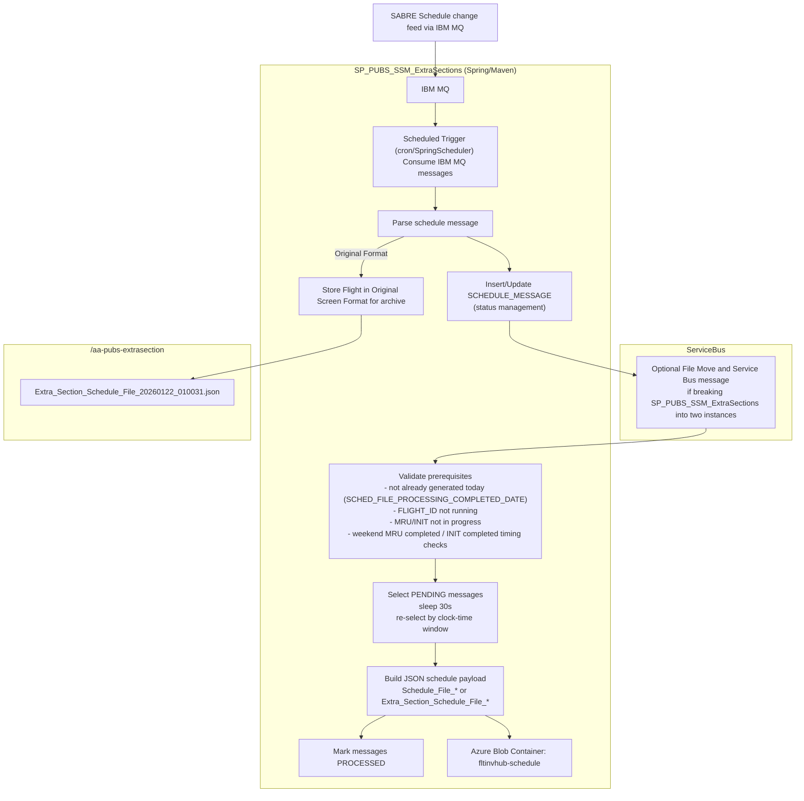

# SP_PUBS_SSM_ExtraSections

### The Extra Section Engine is a stand-alone SpringBoot/Kubernetes application running on a Production Publications Azure node. A SpringScheduler configuration prompts the Engine to regularly poll a SabreMQ via an IBM MQ schedule Upates. Extra sections are determined via flight range.  The Sabre green screen formatted data is effectively screen scraped and reformatted to an IATA standard SSM format in a file then transmitted to ITA via the existing NPPortal/EMFT file transfer system used for the Publications ITA SSIM transmits.

### Each extra session processed is archived to a dated file with the original green screen format and the resulting SSM format, a copy of this is included with a notification emailed to a configurable list of email recipients.


## Flowchart




## Discussion Points

- ** What Protocol is the Google Endpoint?  Will there be WhiteListing and/or firewall holes punched? Is there any resource to contact? Are there any current examples of this functionality currently in AA? **
- How will error handling and retries be managed?
- Are there SLAs for message processing latency?
- *Should Any Manual Intervention take place to process a message to Google? Totally Automatic?*
- Any implications for failure in Service Bus delivery?
- When will we get our SabreMQueue?  Do we own it? Is it ours?
- **Should we Reuse this SP_PUBS_SSM_SWS_API or duplicate it? Duplication means duplicating a lot of boilerplate code.**
- How about an email copy of every update? To whom would this go?

### This is an example of an extra section from the SabreMQ

```json
{
  "messageId": 375698847,
  "ssimType": "ADD",
  "effectiveDate": "Jan 10, 2026",
  "discontinueDate": "Jan 10, 2026",
  "flightNumber": 9603,
  "messageText": "A AA 9603  01J10JAN2610JAN26     6  BOG09000900-0500  MIA13001300-0500  7M8CJRDIUYBHKMLGVSNQOET     XX                 II                                                               E210F2A317BAF2094 AA 9603  01J                801BOGMIAMAX                                                                                                                                              E210F2A317BBB8094 AA 9603  01J                109BOGMIAV V V V V V V V V V V V V V V V V V V V                                                                                                          E210F2A317BBBC094 AA 9603  01J                106BOGMIAC016J016R014D012I008U002Y156B148H136K123M103L090G061V047S039N031Q027O023E008T003                                                                 E210F2A317BBC6095 AA        9603                                                                                                                                                                        E210F2A317DDBC09",
  "clockTime": 16289786634490802000,
  "msgReceivedTime": "2026-01-09 19:51:30.424"
}
```
<br>
A AA 9603  01J10JAN2610JAN26     6  BOG09000900-0500  MIA13001300-0500  7M8CJRDIUYBHKMLGVSNQOET     XX                 II                                                               E210F2A317BAF2094<br> AA 9603  01J                801BOGMIAMAX                                                                                                                                              E210F2A317BBB8094<br> AA 9603  01J                109BOGMIAV V V V V V V V V V V V V V V V V V V V                                                                                                          E210F2A317BBBC094<br AA 9603  01J                106BOGMIAC016J016R014D012I008U002Y156B148H136K123M103L090G061V047S039N031Q027O023E008T003                                                                 E210F2A317BBC6095 AA        9603                                                                                                                                                                        E210F2A317DDBC09
<br>

[Schedule File Processor application:](https://github.com/AAInternal/FltInvhub_Schedule_FileProcessor/)

[Business Rules wiki:](https://github.com/AAInternal/FltInvhub_Schedule_FileProcessor/wiki/File-Processor-Business-Rules)


{"messageId":377050188,"ssimType":"ADD","effectiveDate":"Jan 22, 2026","discontinueDate":"Jan 22, 2026","flightNumber":9602,"messageText":"A AA 9602  01J22JAN2622JAN26   4    EZE20452045-0300  JFK05300530-0500  772XX                       XX                 II                                                               E2200FAA3C0196054 AA 9602  01J                801EZEJFKPE8                                                                                                                                              E2200FAA3C0260054 AA 9602  01J                106EZEJFKCJRDIUWPXYBHKMLGVSNQOET                                                                                                                          E2200FAA3C0264054 AA 9602  01J                109EZEJFKV V V V V V V V V V V V V V V V V V V V V V V                                                                                                    E2200FAA3C0268054 AA 9602  01J                106EZEJFKC035J035R032D026I018U004W024P019X002Y212B201H184K167M140L123G083V064S053N042Q036O032E021T011                                                     E2200FAA3C0274055 AA        9602                                                                                                                                                                        E2200FAA3C2EA805","clockTime":16294040675652048389,"msgReceivedTime":"2026-01-21 20:21:15.435"}
