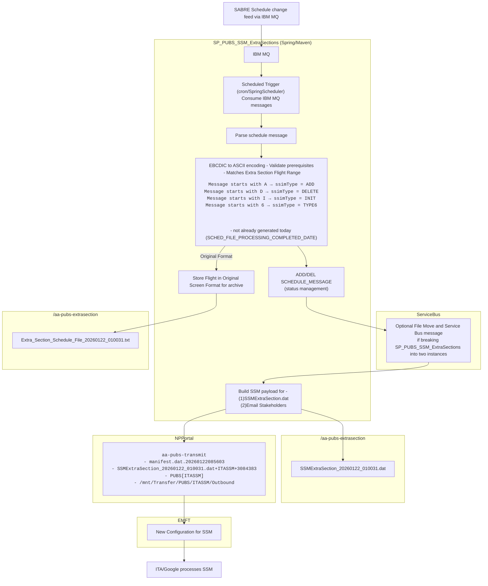

# SP_PUBS_SSM_ExtraSections

## The Extra Section Engine consumes IBM MQ messages and sends the extra sections to ITA google via EMFT

### The Extra Section Engine is a stand-alone SpringBoot/Kubernetes application running on a Production Publications Azure node. A SpringScheduler configuration prompts the Engine to regularly poll a SabreMQ via an IBM MQ schedule Upates. Extra sections are determined via flight range.  The Sabre green screen formatted data is effectively screen scraped and reformatted to an IATA standard SSM format in a file then each file is transmitted to ITA via EMFT with a new NPPortal/EMFT jobs ismilar to the existing NPPortal/EMFT file transfer system used for the Publications ITA SSIM transmits.

### Each extra session processed is archived to a dated file with the original green screen format and the resulting SSM format, a copy of this is included with a notification emailed to a configurable list of email recipients.

#### Assumptions
* Once moved to production there is no human interaction to decide if an extra section is published, this is unlike Publications SABRE SSM
* We may only do ADD and DELETE types
* We may only schedule Monday and Tuesday or just weekdays, no weekend processing to avoid MRU.  Casper seems to grab each day's changes at 1:00Central, but they are processing everything EXCEPT extra sections.
* The extra sections will not be enriched with Code share marketing data or enriched with Publications Logic.
* Will not have a UI, will communicate via Email to a list of stakeholders

## Flowchart




## Discussion Points

- ** We will need ITA contact/interface for developing the SFTP formats and validation. **
- Will ITA have an error reporting system?
- When will we get our SabreMQueue?  Do we own it? Is it ours?
- We need discussion about this datasource with the IOC

### This is an example of an extra section from the SabreMQ in Casper's json message formatting.

```json
{
  "messageId": 375698847,
  "ssimType": "ADD",
  "effectiveDate": "Jan 10, 2026",
  "discontinueDate": "Jan 10, 2026",
  "flightNumber": 9603,
  "messageText": "A AA 9603  01J10JAN2610JAN26     6  BOG09000900-0500  MIA13001300-0500  7M8CJRDIUYBHKMLGVSNQOET     XX                 II                                                               E210F2A317BAF2094 AA 9603  01J                801BOGMIAMAX                                                                                                                                              E210F2A317BBB8094 AA 9603  01J                109BOGMIAV V V V V V V V V V V V V V V V V V V V                                                                                                          E210F2A317BBBC094 AA 9603  01J                106BOGMIAC016J016R014D012I008U002Y156B148H136K123M103L090G061V047S039N031Q027O023E008T003                                                                 E210F2A317BBC6095 AA        9603                                                                                                                                                                        E210F2A317DDBC09",
  "clockTime": 16289786634490802000,
  "msgReceivedTime": "2026-01-09 19:51:30.424"
}
```
<br>
A<br> AA 9603  01J10JAN2610JAN26     6  BOG09000900-0500  MIA13001300-0500  7M8CJRDIUYBHKMLGVSNQOET     XX                 II                                                               E210F2A317BAF2094<br> AA 9603  01J                801BOGMIAMAX                                                                                                                                              E210F2A317BBB8094<br> AA 9603  01J                109BOGMIAV V V V V V V V V V V V V V V V V V V V                                                                                                          E210F2A317BBBC094<br AA 9603  01J                106BOGMIAC016J016R014D012I008U002Y156B148H136K123M103L090G061V047S039N031Q027O023E008T003                                                                 E210F2A317BBC6095 AA        9603                                                                                                                                                                        E210F2A317DDBC09
<br>
<br\><br\>

MORE JSON EXAMPLES:

```json
{"messageId":377050188,"ssimType":"ADD","effectiveDate":"Jan 22, 2026","discontinueDate":"Jan 22, 2026","flightNumber":9602,"messageText":"A AA 9602  01J22JAN2622JAN26   4    EZE20452045-0300  JFK05300530-0500  772XX                       XX                 II                                                               E2200FAA3C0196054 AA 9602  01J                801EZEJFKPE8                                                                                                                                              E2200FAA3C0260054 AA 9602  01J                106EZEJFKCJRDIUWPXYBHKMLGVSNQOET                                                                                                                          E2200FAA3C0264054 AA 9602  01J                109EZEJFKV V V V V V V V V V V V V V V V V V V V V V V                                                                                                    E2200FAA3C0268054 AA 9602  01J                106EZEJFKC035J035R032D026I018U004W024P019X002Y212B201H184K167M140L123G083V064S053N042Q036O032E021T011                                                     E2200FAA3C0274055 AA        9602                                                                                                                                                                        E2200FAA3C2EA805","clockTime":16294040675652048389,"msgReceivedTime":"2026-01-21 20:21:15.435"}
```
```json
{"messageId":377050170,"ssimType":"ADD","effectiveDate":"Jan 19, 2026","discontinueDate":"Jan 19, 2026","flightNumber":9607,"messageText":"A AA 9607  01J19JAN2619JAN261       LAX17301730-0800  LHR12051205+0000  77WXX                       XX                 II                                                               E21D530DA054AA094 AA 9607  01J                801LAXLHRPE9                                                                                                                                              E21D530DA0555E094 AA 9607  01J                106LAXLHRFAZCJRDIUWPXYBHKMLGVSNQOET                                                                                                                       E21D530DA05562094 AA 9607  01J                109LAXLHRB V V V V V V V V V V V V V V V V V V V V V V V V V                                                                                              E21D530DA05568094 AA 9607  01J                106LAXLHRF008A007Z005C052J052R047D039I026U005W028P022X003Y216B205H188K171M143L125G084V065S054N043Q037O032E022T011                                         E21D530DA0559C095 AA        9607                                                                                                                                                                        E21D530DA083F009","clockTime":16293270344885905929,"msgReceivedTime":"2026-01-19 16:06:46.402"}
{"messageId":377050171,"ssimType":"ADD","effectiveDate":"Jan 20, 2026","discontinueDate":"Jan 20, 2026","flightNumber":9601,"messageText":"A AA 9601  01J20JAN2620JAN26 2      LHR17351735+0000  JFK18351835-0500  77WXX                       XX                 II                                                               E21D53916B1362054 AA 9601  01J                801LHRJFKPE9                                                                                                                                              E21D53916B13F6054 AA 9601  01J                106LHRJFKFAZCJRDIUWPXYBHKMLGVSNQOET                                                                                                                       E21D53916B13FA054 AA 9601  01J                109LHRJFKB V V V V V V V V V V V V V V V V V V V V V V V V V                                                                                              E21D53916B1416054 AA 9601  01J                106LHRJFKF008A007Z005C052J052R047D039I026U005W028P022X003Y216B205H188K171M143L125G084V065S054N043Q037O032E022T011                                         E21D53916B1424055 AA        9601                                                                                                                                                                        E21D53916B3E7C05","clockTime":16293270910928118277,"msgReceivedTime":"2026-01-19 16:09:03.620"}
{"messageId":377050063,"ssimType":"ADD","effectiveDate":"Jan 19, 2026","discontinueDate":"Jan 19, 2026","flightNumber":9608,"messageText":"A AA 9608  01J19JAN2619JAN261       LAX17301730-0800  LHR12051205+0000  788XX                       XX                 II                                                               E21D641874D94C014 AA 9608  01J                801LAXLHR78W                                                                                                                                              E21D641874D9D6014 AA 9608  01J                106LAXLHRCJRDIUWPXYBHKMLGVSNQOET                                                                                                                          E21D641874D9DA014 AA 9608  01J                109LAXLHRV V V V V V V V V V V V V V V V V V V V V V V                                                                                                    E21D641874D9DE014 AA 9608  01J                106LAXLHRC020J020R018D015I010U002W028P023X003Y186B177H162K147M123L108G073V056S047N038Q032O028E019T010                                                     E21D641874D9EA015 AA        9608                                                                                                                                                                        E21D641874F7E801","clockTime":16293289083098713089,"msgReceivedTime":"2026-01-19 17:23:00.636"}
{"messageId":377050064,"ssimType":"ADD","effectiveDate":"Jan 20, 2026","discontinueDate":"Jan 20, 2026","flightNumber":9602,"messageText":"A AA 9602  01J20JAN2620JAN26 2      LHR15351535+0000  JFK18401840-0500  788XX                       XX                 II                                                               E21D64B3E97F3A084 AA 9602  01J                801LHRJFK78W                                                                                                                                              E21D64B3E97FE8084 AA 9602  01J                106LHRJFKCJRDIUWPXYBHKMLGVSNQOET                                                                                                                          E21D64B3E97FEC084 AA 9602  01J                109LHRJFKV V V V V V V V V V V V V V V V V V V V V V V                                                                                                    E21D64B3E97FF2084 AA 9602  01J                106LHRJFKC020J020R018D015I010U002W028P023X003Y186B177H162K147M123L108G073V056S047N038Q032O028E019T010                                                     E21D64B3E97FFE085 AA        9602                                                                                                                                                                        E21D64B3E9A12408","clockTime":16293289750775675400,"msgReceivedTime":"2026-01-19 17:25:43.211"}

```
<pre>
A AA 9602  01J20JAN2620JAN26 2      LHR15351535+0000  JFK18401840-0500  788XX                       XX                 II                                                               E21D64B3E97F3A084
  AA 9602  01J                801LHRJFK78W                                                                                                                                              E21D64B3E97FE8084
  AA 9602  01J                106LHRJFKCJRDIUWPXYBHKMLGVSNQOET                                                                                                                          E21D64B3E97FEC084
  AA 9602  01J                109LHRJFKV V V V V V V V V V V V V V V V V V V V V V V                                                                                                    E21D64B3E97FF2084
  AA 9602  01J                106LHRJFKC020J020R018D015I010U002W028P023X003Y186B177H162K147M123L108G073V056S047N038Q032O028E019T010                                                     E21D64B3E97FFE085
  AA        9602                                                                                                                                                                        E21D64B3E9A12408
  </pre>
<br\><br\><br\>
## Regular sections because they contain DELETE examples
```json
{"messageId":377050154,"ssimType":"DELETE","effectiveDate":"Jan 18, 2026","discontinueDate":"Jan 18, 2026","flightNumber":3396,"messageText":"D AA 3396  01J18JAN2618JAN26      7 MIA               HPN                                                                                                                               E21C65A97B2DFE055 AA        3396                                                                                                                                                                        E21C65A97B4BFA05","clockTime":16293009330510102021,"msgReceivedTime":"2026-01-18 22:24:41.568"}
{"messageId":377050153,"ssimType":"ADD","effectiveDate":"Jan 18, 2026","discontinueDate":"Jan 18, 2026","flightNumber":3396,"messageText":"A AA 3396  01J18JAN2618JAN26      7 MIA19451945-0500  SYR23212321-0500  E75CJRDIUYBHKMLGVSNQOET     D D D D D          DD                                                               E21C65A97B93F2054 AA 3396  01J                801MIASYRWCZ                                                                                                                                              E21C65A97C1FB2054 AA 3396  01J                106MIASYRC012J012R011D009I006U001Y063B061H066K065M064L063G062V061S060N059Q058O057E000T001                                                                 E21C65A97C1FBE054 AA 3396  01J                127MIAHPN ENVOY AIR AS AMERICAN EAGLE                                                                                                                     E21C65A97C2C9205A AA 3396  02J18JAN2618JAN26      7 SYR23502350-0500  HPN22592259-0500  E75CJRDIUYBHKMLGVSNQOET                        DD                                                               E21C65A97C4520054 AA 3396  02J                801SYRHPNWCZ                                                                                                                                              E21C65A97C4F06054 AA 3396  02J                106SYRHPNC012J012R011D009I006U001Y063B061H066K065M064L063G062V061S060N059Q058O057E000T001                                                                 E21C65A97C4F12055 AA        3396                                                                                                                                                                        E21C65A97C85F605","clockTime":16293009330516783621,"msgReceivedTime":"2026-01-18 22:24:41.555"}
{"messageId":377050156,"ssimType":"DELETE","effectiveDate":"Jan 18, 2026","discontinueDate":"Jan 18, 2026","flightNumber":3396,"messageText":"D AA 3396  01J18JAN2618JAN26      7 MIA               SYR                                                                                                                               E21C65B80C28FE07D AA 3396  02J18JAN2618JAN26      7 SYR               HPN                                                                                                                               E21C65B80C2982075 AA        3396                                                                                                                                                                        E21C65B80C463407","clockTime":16293009393072012807,"msgReceivedTime":"2026-01-18 22:24:56.494"}
{"messageId":377050155,"ssimType":"ADD","effectiveDate":"Jan 18, 2026","discontinueDate":"Jan 18, 2026","flightNumber":3396,"messageText":"A AA 3396  01J18JAN2618JAN26      7 MIA19451945-0500  SYR23212321-0500  E75CJRDIUYBHKMLGVSNQOET     D D D D D          DD                                                               E21C65B80C7584074 AA 3396  01J                801MIASYRWCZ                                                                                                                                              E21C65B80C9114074 AA 3396  01J                106MIASYRC012J012R011D009I006U001Y063B061H066K065M064L063G062V061S060N059Q058O057E000T001                                                                 E21C65B80C911E074 AA 3396  01J                127MIAHPN ENVOY AIR AS AMERICAN EAGLE                                                                                                                     E21C65B80C99F407A AA 3396  02J18JAN2618JAN26      7 SYR19501950-0500  HPN22592259-0500  E75CJRDIUYBHKMLGVSNQOET                        DD                                                               E21C65B80CAE28074 AA 3396  02J                801SYRHPNWCZ                                                                                                                                              E21C65B80CB6F0074 AA 3396  02J                106SYRHPNC012J012R011D009I006U001Y063B061H066K065M064L063G062V061S060N059Q058O057E000T001                                                                 E21C65B80CB6FA075 AA        3396                                                                                                                                                                        E21C65B80CEA3607","clockTime":16293009393077027847,"msgReceivedTime":"2026-01-18 22:24:56.486"}
{"messageId":377050158,"ssimType":"DELETE","effectiveDate":"Jan 18, 2026","discontinueDate":"Jan 18, 2026","flightNumber":3396,"messageText":"D AA 3396  01J18JAN2618JAN26      7 MIA               SYR                                                                                                                               E21C65BCABB95801D AA 3396  02J18JAN2618JAN26      7 SYR               HPN                                                                                                                               E21C65BCABB9E0015 AA        3396                                                                                                                                                                        E21C65BCABE2E401","clockTime":16293009412928919553,"msgReceivedTime":"2026-01-18 22:25:06.065"}
{"messageId":377050157,"ssimType":"ADD","effectiveDate":"Jan 18, 2026","discontinueDate":"Jan 18, 2026","flightNumber":3396,"messageText":"A AA 3396  01J18JAN2618JAN26      7 MIA19451945-0500  SYR23212321-0500  E75CJRDIUYBHKMLGVSNQOET     D D D D D          DD                                                               E21C65BCAC21C8014 AA 3396  01J                801MIASYRWCZ                                                                                                                                              E21C65BCAC31F0014 AA 3396  01J                106MIASYRC012J012R011D009I006U001Y063B061H066K065M064L063G062V061S060N059Q058O057E000T001                                                                 E21C65BCAC31FA014 AA 3396  01J                127MIAHPN ENVOY AIR AS AMERICAN EAGLE                                                                                                                     E21C65BCAC3A1C01A AA 3396  02J18JAN2618JAN26      7 SYR15501550-0500  HPN22592259-0500  E75CJRDIUYBHKMLGVSNQOET                        DD                                                               E21C65BCAC4A4E014 AA 3396  02J                801SYRHPNWCZ                                                                                                                                              E21C65BCAC5186014 AA 3396  02J                106SYRHPNC012J012R011D009I006U001Y063B061H066K065M064L063G062V061S060N059Q058O057E000T001                                                                 E21C65BCAC51AA015 AA        3396                                                                                                                                                                        E21C65BCAC7DD001","clockTime":16293009412935763969,"msgReceivedTime":"2026-01-18 22:25:06.059"}
{"messageId":377050160,"ssimType":"DELETE","effectiveDate":"Jan 18, 2026","discontinueDate":"Jan 18, 2026","flightNumber":3396,"messageText":"D AA 3396  01J18JAN2618JAN26      7 MIA               SYR                                                                                                                               E21C65C1344AA802D AA 3396  02J18JAN2618JAN26      7 SYR               HPN                                                                                                                               E21C65C1344B30025 AA        3396                                                                                                                                                                        E21C65C13486F402","clockTime":16293009432400013314,"msgReceivedTime":"2026-01-18 22:25:06.087"}
{"messageId":377050159,"ssimType":"ADD","effectiveDate":"Jan 18, 2026","discontinueDate":"Jan 18, 2026","flightNumber":3396,"messageText":"A AA 3396  01J18JAN2618JAN26      7 MIA19451945-0500  SYR23212321-0500  E75CJRDIUYBHKMLGVSNQOET     D D D D D          DD                                                               E21C65C13575B6024 AA 3396  01J                801MIASYRWCZ                                                                                                                                              E21C65C13585F4024 AA 3396  01J                106MIASYRC012J012R011D009I006U001Y063B061H066K065M064L063G062V061S060N059Q058O057E000T001                                                                 E21C65C13585FE024 AA 3396  01J                127MIAHPN ENVOY AIR AS AMERICAN EAGLE                                                                                                                     E21C65C135A24C02A AA 3396  02J18JAN2618JAN26      7 SYR11501150-0500  HPN22592259-0500  E75CJRDIUYBHKMLGVSNQOET                        DD                                                               E21C65C135B2D4024 AA 3396  02J                801SYRHPNWCZ                                                                                                                                              E21C65C135C23E024 AA 3396  02J                106SYRHPNC012J012R011D009I006U001Y063B061H066K065M064L063G062V061S060N059Q058O057E000T001                                                                 E21C65C135C248025 AA        3396                                                                                                                                                                        E21C65C136025A02","clockTime":16293009432419612162,"msgReceivedTime":"2026-01-18 22:25:06.084"}
{"messageId":377050162,"ssimType":"DELETE","effectiveDate":"Jan 18, 2026","discontinueDate":"Jan 18, 2026","flightNumber":3396,"messageText":"D AA 3396  01J18JAN2618JAN26      7 MIA               SYR                                                                                                                               E21C65C5F1010402D AA 3396  02J18JAN2618JAN26      7 SYR               HPN                                                                                                                               E21C65C5F10188025 AA        3396                                                                                                                                                                        E21C65C5F127BA02","clockTime":16293009452745950210,"msgReceivedTime":"2026-01-18 22:25:11.070"}
{"messageId":377050161,"ssimType":"ADD","effectiveDate":"Jan 18, 2026","discontinueDate":"Jan 18, 2026","flightNumber":3396,"messageText":"A AA 3396  01J18JAN2618JAN26      7 MIA19451945-0500  SYR23212321-0500  E75CJRDIUYBHKMLGVSNQOET     D D D D D          DD                                                               E21C65C5F17784024 AA 3396  01J                801MIASYRWCZ                                                                                                                                              E21C65C5F187BC024 AA 3396  01J                106MIASYRC012J012R011D009I006U001Y063B061H066K065M064L063G062V061S060N059Q058O057E000T001                                                                 E21C65C5F187E2024 AA 3396  01J                127MIAHPN ENVOY AIR AS AMERICAN EAGLE                                                                                                                     E21C65C5F18EE602A AA 3396  02J18JAN2618JAN26      7 SYR07500750-0500  HPN22592259-0500  E75CJRDIUYBHKMLGVSNQOET                        DD                                                               E21C65C5F19F48024 AA 3396  02J                801SYRHPNWCZ                                                                                                                                              E21C65C5F1A8A4024 AA 3396  02J                106SYRHPNC012J012R011D009I006U001Y063B061H066K065M064L063G062V061S060N059Q058O057E000T001                                                                 E21C65C5F1A8AE025 AA        3396                                                                                                                                                                        E21C65C5F1D52E02","clockTime":16293009452753716226,"msgReceivedTime":"2026-01-18 22:25:11.063"}
{"messageId":377050164,"ssimType":"DELETE","effectiveDate":"Jan 18, 2026","discontinueDate":"Jan 18, 2026","flightNumber":3396,"messageText":"D AA 3396  01J18JAN2618JAN26      7 MIA               SYR                                                                                                                               E21C65CA25375808D AA 3396  02J18JAN2618JAN26      7 SYR               HPN                                                                                                                               E21C65CA2537D6085 AA        3396                                                                                                                                                                        E21C65CA257BE808","clockTime":16293009470801795080,"msgReceivedTime":"2026-01-18 22:25:16.076"}
{"messageId":377050163,"ssimType":"ADD","effectiveDate":"Jan 18, 2026","discontinueDate":"Jan 18, 2026","flightNumber":3396,"messageText":"A AA 3396  01J18JAN2618JAN26      7 MIA19451945-0500  SYR23212321-0500  E75CJRDIUYBHKMLGVSNQOET     D D D D D          DD                                                               E21C65CA25D19C084 AA 3396  01J                801MIASYRWCZ                                                                                                                                              E21C65CA25E442084 AA 3396  01J                106MIASYRC012J012R011D009I006U001Y063B061H066K065M064L063G062V061S060N059Q058O057E000T001                                                                 E21C65CA25E44E084 AA 3396  01J                127MIAHPN ENVOY AIR AS AMERICAN EAGLE                                                                                                                     E21C65CA25ECA808A AA 3396  02J18JAN2618JAN26      7 SYR03500350-0500  HPN22592259-0500  E75CJRDIUYBHKMLGVSNQOET                        DD                                                               E21C65CA25FD6C084 AA 3396  02J                801SYRHPNWCZ                                                                                                                                              E21C65CA260550084 AA 3396  02J                106SYRHPNC012J012R011D009I006U001Y063B061H066K065M064L063G062V061S060N059Q058O057E000T001                                                                 E21C65CA26055A085 AA        3396                                                                                                                                                                        E21C65CA26551808","clockTime":16293009470811905032,"msgReceivedTime":"2026-01-18 22:25:16.068"}
{"messageId":377050166,"ssimType":"DELETE","effectiveDate":"Jan 18, 2026","discontinueDate":"Jan 18, 2026","flightNumber":3396,"messageText":"D AA 3396  01J18JAN2618JAN26      7 MIA               SYR                                                                                                                               E21C65CEEFB21A01D AA 3396  02J18JAN2618JAN26      7 SYR               HPN                                                                                                                               E21C65CEEFB29E015 AA        3396                                                                                                                                                                        E21C65CEEFEA9601","clockTime":16293009491378706945,"msgReceivedTime":"2026-01-18 22:25:21.081"}
{"messageId":377050165,"ssimType":"ADD","effectiveDate":"Jan 18, 2026","discontinueDate":"Jan 18, 2026","flightNumber":3396,"messageText":"A AA 3396  01J18JAN2618JAN26      7 MIA19451945-0500  SYR23212321-0500  E75CJRDIUYBHKMLGVSNQOET     D D D D D          DD                                                               E21C65CEF02E76014 AA 3396  01J                801MIASYRWCZ                                                                                                                                              E21C65CEF03FE0014 AA 3396  01J                106MIASYRC012J012R011D009I006U001Y063B061H066K065M064L063G062V061S060N059Q058O057E000T001                                                                 E21C65CEF03FEC014 AA 3396  01J                127MIAHPN ENVOY AIR AS AMERICAN EAGLE                                                                                                                     E21C65CEF0475601A AA 3396  02J18JAN2618JAN26      7 SYR01350135-0500  HPN22592259-0500  E75CJRDIUYBHKMLGVSNQOET                        DD                                                               E21C65CEF05716014 AA 3396  02J                801SYRHPNWCZ                                                                                                                                              E21C65CEF05F34014 AA 3396  02J                106SYRHPNC012J012R011D009I006U001Y063B061H066K065M064L063G062V061S060N059Q058O057E000T001                                                                 E21C65CEF05F3E015 AA        3396                                                                                                                                                                        E21C65CEF0A05E01","clockTime":16293009491386856961,"msgReceivedTime":"2026-01-18 22:25:21.074"}
{"messageId":377050050,"ssimType":"DELETE","effectiveDate":"Jan 18, 2026","discontinueDate":"Jan 18, 2026","flightNumber":1054,"messageText":"D AA 1054  01J18JAN2618JAN26      7 MIA               BOS                                                                                                                               E21C9F99FB5980065 AA        1054                                                                                                                                                                        E21C9F99FB784406","clockTime":16293073035615371270,"msgReceivedTime":"2026-01-19 02:43:55.124"}
{"messageId":377050051,"ssimType":"ADD","effectiveDate":"Jan 18, 2026","discontinueDate":"Jan 18, 2026","flightNumber":1054,"messageText":"A AA 1054  01J18JAN2618JAN26      7 MIA21452145-0500  JFK01110111-0500  738CJRDIUYBHKMLGVSNQOET     XX                 DD                           O                                   E21C9F99FBB97E064 AA 1054  01J                801MIAJFK38O                                                                                                                                              E21C9F99FBCBFA064 AA 1054  01J                109MIAJFKR R R R R R R R R R R R R R R R R R R R                                                                                                          E21C9F99FBCBFE064 AA 1054  01J                106MIAJFKC016J016R014D012I008U001Y156B148H169K168M167L166G165V164S163N162Q161O160E000T007                                                                 E21C9F99FBCC0C06A AA 1054  02J18JAN2618JAN26      7 JFK22002200-0500  BOS00590059-0500B 738CJRDIUYBHKMLGVSNQOET                        DD                           O                                   E21C9F99FBF4EC064 AA 1054  02J                801JFKBOS38O                                                                                                                                              E21C9F99FC00F2064 AA 1054  02J                106JFKBOSC016J016R014D012I008U001Y156B148H169K168M167L166G165V164S163N162Q161O160E000T007                                                                 E21C9F99FC00FC065 AA        1054                                                                                                                                                                        E21C9F99FC3BCA06","clockTime":16293073035621662214,"msgReceivedTime":"2026-01-19 02:43:55.229"}
{"messageId":377050052,"ssimType":"DELETE","effectiveDate":"Jan 18, 2026","discontinueDate":"Jan 18, 2026","flightNumber":1054,"messageText":"D AA 1054  01J18JAN2618JAN26      7 MIA               JFK                                                                                                                               E21C9FB0EE8A0C05D AA 1054  02J18JAN2618JAN26      7 JFK               BOS                                                                                                                               E21C9FB0EE8A8C055 AA        1054                                                                                                                                                                        E21C9FB0EEA5E205","clockTime":16293073134184696837,"msgReceivedTime":"2026-01-19 02:44:18.263"}
{"messageId":377050053,"ssimType":"ADD","effectiveDate":"Jan 18, 2026","discontinueDate":"Jan 18, 2026","flightNumber":1054,"messageText":"A AA 1054  01J18JAN2618JAN26      7 MIA21452145-0500  JFK01110111-0500  738CJRDIUYBHKMLGVSNQOET     XX                 DD                           O                                   E21C9FB0EEE59C054 AA 1054  01J                801MIAJFK38O                                                                                                                                              E21C9FB0EEFBD2054 AA 1054  01J                109MIAJFKR R R R R R R R R R R R R R R R R R R R                                                                                                          E21C9FB0EEFBD8054 AA 1054  01J                106MIAJFKC016J016R014D012I008U001Y156B148H169K168M167L166G165V164S163N162Q161O160E000T007                                                                 E21C9FB0EEFBE205A AA 1054  02J18JAN2618JAN26      7 JFK15001500-0500  BOS00590059-0500B 738CJRDIUYBHKMLGVSNQOET                        DD                           O                                   E21C9FB0EF18EE054 AA 1054  02J                801JFKBOS38O                                                                                                                                              E21C9FB0EF2226054 AA 1054  02J                106JFKBOSC016J016R014D012I008U001Y156B148H169K168M167L166G165V164S163N162Q161O160E000T007                                                                 E21C9FB0EF2230055 AA        1054                                                                                                                                                                        E21C9FB0EF542805","clockTime":16293073134190697477,"msgReceivedTime":"2026-01-19 02:44:18.292"}
{"messageId":377050054,"ssimType":"DELETE","effectiveDate":"Jan 18, 2026","discontinueDate":"Jan 18, 2026","flightNumber":1054,"messageText":"D AA 1054  01J18JAN2618JAN26      7 MIA               JFK                                                                                                                               E21C9FB5FE0E9406D AA 1054  02J18JAN2618JAN26      7 JFK               BOS                                                                                                                               E21C9FB5FE0F1C065 AA        1054                                                                                                                                                                        E21C9FB5FE396A06","clockTime":16293073155919877126,"msgReceivedTime":"2026-01-19 02:44:28.183"}
{"messageId":377050055,"ssimType":"ADD","effectiveDate":"Jan 18, 2026","discontinueDate":"Jan 18, 2026","flightNumber":1054,"messageText":"A AA 1054  01J18JAN2618JAN26      7 MIA21452145-0500  JFK01110111-0500  738CJRDIUYBHKMLGVSNQOET     XX                 DD                           O                                   E21C9FB5FE860E064 AA 1054  01J                801MIAJFK38O                                                                                                                                              E21C9FB5FE9A64064 AA 1054  01J                109MIAJFKR R R R R R R R R R R R R R R R R R R R                                                                                                          E21C9FB5FE9A68064 AA 1054  01J                106MIAJFKC016J016R014D012I008U001Y156B148H169K168M167L166G165V164S163N162Q161O160E000T007                                                                 E21C9FB5FE9A7606A AA 1054  02J18JAN2618JAN26      7 JFK08000800-0500  BOS00590059-0500B 738CJRDIUYBHKMLGVSNQOET                        DD                           O                                   E21C9FB5FEB4C2064 AA 1054  02J                801JFKBOS38O                                                                                                                                              E21C9FB5FEBE2C064 AA 1054  02J                106JFKBOSC016J016R014D012I008U001Y156B148H169K168M167L166G165V164S163N162Q161O160E000T007                                                                 E21C9FB5FEBE50065 AA        1054                                                                                                                                                                        E21C9FB5FEF1DC06","clockTime":16293073155927707142,"msgReceivedTime":"2026-01-19 02:44:28.212"}
{"messageId":377050056,"ssimType":"ADD","effectiveDate":"Jan 19, 2026","discontinueDate":"Jan 19, 2026","flightNumber":9603,"messageText":"A AA 9603  01J19JAN2619JAN261       JFK09000900-0500  EZE21502150-0300  772XX                       XX                 II                                                               E21CA13B694640044 AA 9603  01J                801JFKEZEPE6                                                                                                                                              E21CA13B6946D8044 AA 9603  01J                106JFKEZECJRDIUWPXYBHKMLGVSNQOET                                                                                                                          E21CA13B6946DE044 AA 9603  01J                109JFKEZEV V V V V V V V V V V V V V V V V V V V V V V                                                                                                    E21CA13B6946E2044 AA 9603  01J                106JFKEZEC037J037R033D028I019U004W024P019X002Y212B201H184K167M140L123G083V064S053N042Q036O032E021T011                                                     E21CA13B69470A045 AA        9603                                                                                                                                                                        E21CA13B6971A804","clockTime":16293074828460965892,"msgReceivedTime":"2026-01-19 02:51:12.119"}
{"messageId":377050057,"ssimType":"ADD","effectiveDate":"Jan 19, 2026","discontinueDate":"Jan 19, 2026","flightNumber":9604,"messageText":"A AA 9604  01J19JAN2619JAN261       EZE23152315-0300  JFK08000800-0500  772XX                       XX                 II                                                               E21CA1A8844E30084 AA 9604  01J                801EZEJFKPE6                                                                                                                                              E21CA1A8844EEA084 AA 9604  01J                106EZEJFKCJRDIUWPXYBHKMLGVSNQOET                                                                                                                          E21CA1A8844EEE084 AA 9604  01J                109EZEJFKV V V V V V V V V V V V V V V V V V V V V V V                                                                                                    E21CA1A8844EF4084 AA 9604  01J                106EZEJFKC037J037R033D028I019U004W024P019X002Y212B201H184K167M140L123G083V064S053N042Q036O032E021T011                                                     E21CA1A8844F00085 AA        9604                                                                                                                                                                        E21CA1A8846F2C08","clockTime":16293075297065906184,"msgReceivedTime":"2026-01-19 02:53:06.330"}
{"messageId":377050167,"ssimType":"ADD","effectiveDate":"Jan 19, 2026","discontinueDate":"Jan 19, 2026","flightNumber":9605,"messageText":"A AA 9605  01J19JAN2619JAN261       DFW11001100-0600  OGG15091509-1000  788XX                       XX                 DD                                                               E21CB1EAE23968064 AA 9605  01J                801DFWOGG78W                                                                                                                                              E21CB1EAE23A2A064 AA 9605  01J                106DFWOGGCJRDIUWPXYBHKMLGVSNQOET                                                                                                                          E21CB1EAE23A48064 AA 9605  01J                109DFWOGGV V V V V V V V V V V V V V V V V V V V V V V                                                                                                    E21CB1EAE23A4C064 AA 9605  01J                106DFWOGGC020J020R018D015I010U002W028P023X003Y186B177H162K147M123L108G073V056S047N038Q032O028E019T010                                                     E21CB1EAE23A58065 AA        9605                                                                                                                                                                        E21CB1EAE259D606","clockTime":16293093174295488518,"msgReceivedTime":"2026-01-19 04:05:51.117"}
{"messageId":377050168,"ssimType":"ADD","effectiveDate":"Jan 19, 2026","discontinueDate":"Jan 19, 2026","flightNumber":9606,"messageText":"A AA 9606  01J19JAN2619JAN261       OGG20072007-1000  DFW07000700-0600  788XX                       XX                 DD                                                               E21CB24C964190074 AA 9606  01J                801OGGDFW78W                                                                                                                                              E21CB24C964246074 AA 9606  01J                106OGGDFWCJRDIUWPXYBHKMLGVSNQOET                                                                                                                          E21CB24C96424A074 AA 9606  01J                109OGGDFWV V V V V V V V V V V V V V V V V V V V V V V                                                                                                    E21CB24C96424E074 AA 9606  01J                106OGGDFWC020J020R018D015I010U002W028P023X003Y186B177H162K147M123L108G073V056S047N038Q032O028E019T010                                                     E21CB24C96425C075 AA        9606                                                                                                                                                                        E21CB24C966FE207","clockTime":16293093593927749639,"msgReceivedTime":"2026-01-19 04:07:33.328"}
{"messageId":377050058,"ssimType":"DELETE","effectiveDate":"Jan 19, 2026","discontinueDate":"Jan 19, 2026","flightNumber":1377,"messageText":"D AA 1377  01J19JAN2619JAN261       MIA               LIR                                                                                                                               E21D2E1B58D03E085 AA        1377                                                                                                                                                                        E21D2E1B58F2AE08","clockTime":16293229721885359624,"msgReceivedTime":"2026-01-19 13:21:28.471"}
{"messageId":377050059,"ssimType":"ADD","effectiveDate":"Jan 19, 2026","discontinueDate":"Jan 19, 2026","flightNumber":1377,"messageText":"A AA 1377  01J19JAN2619JAN261       MIA10051005-0500  SAL13201320-0600  321CJRDIUYBHKMLGVSNQOET     XX                 II                                                               E21D2E1B592F46084 AA 1377  01J                801MIASALO21                                                                                                                                              E21D2E1B594A4A084 AA 1377  01J                109MIASALL L L L L L F F F F F F F F F F F F F F                                                                                                          E21D2E1B594A4E084 AA 1377  01J                106MIASALC018J018R018D015I010U002Y167B161H169K168M167L166G165V164S163N162Q161O160E155T008                                                                 E21D2E1B594A5808A AA 1377  02J19JAN2619JAN261       SAL13481348-0600  LIR12121212-0600  321CJRDIUYBHKMLGVSNQOET                        II                                                               E21D2E1B59690A084 AA 1377  02J                801SALLIRO21                                                                                                                                              E21D2E1B59726A084 AA 1377  02J                106SALLIRC018J018R018D015I010U002Y167B161H169K168M167L166G165V164S163N162Q161O160E155T008                                                                 E21D2E1B597274085 AA        1377                                                                                                                                                                        E21D2E1B59A65208","clockTime":16293229721891587592,"msgReceivedTime":"2026-01-19 13:21:28.577"}
{"messageId":377050061,"ssimType":"DELETE","effectiveDate":"Jan 19, 2026","discontinueDate":"Jan 19, 2026","flightNumber":5188,"messageText":"D AA 5188  01J19JAN2619JAN261       CLT               ELH                                                                                                                               E21D33D58BF6A607D AA 5188  02J19JAN2619JAN261       ELH               CLT                                                                                                                               E21D33D58BF726075 AA        5188                                                                                                                                                                        E21D33D58C2F7E07","clockTime":16293236019165570567,"msgReceivedTime":"2026-01-19 13:47:05.386"}
{"messageId":377050060,"ssimType":"ADD","effectiveDate":"Jan 19, 2026","discontinueDate":"Jan 19, 2026","flightNumber":5188,"messageText":"A AA 5188  01J19JAN2619JAN261       CLT10401040-0500  PBI14131413-0500  CR7CJRDIUYBHKMLGVSNQOET                        DD                              A                                E21D33D58CE7E4074 AA 5188  01J                801CLTPBIP65                                                                                                                                              E21D33D58D23F8074 AA 5188  01J                106CLTPBIC009J009R008D006I004U001Y056B053H055K054M053L052G051V050S049N048Q047O046E042T002                                                                 E21D33D58D2DF4074 AA 5188  01J                127CLTELH PSA AIRLINES AS AMERICAN EAGLE                                                                                                                  E21D33D58D52E207A AA 5188  02J19JAN2619JAN261       PBI14351435-0500  ELH13061306-0500  CR7CJRDIUYBHKMLGVSNQOET                        ID                                                               E21D33D58DCDBA074 AA 5188  02J                801PBIELHP65                                                                                                                                              E21D33D58DEB4C074 AA 5188  02J                106PBIELHC009J009R008D006I004U001Y056B053H055K054M053L052G051V050S049N048Q047O046E042T002                                                                 E21D33D58DF35607A AA 5188  03J19JAN2619JAN261       ELH13501350-0500  CLT16361636-0500  CR7CJRDIUYBHKMLGVSNQOET                        DI                                                               E21D33D58E76A0074 AA 5188  03J                801ELHCLTP65                                                                                                                                              E21D33D58E9994074 AA 5188  03J                106ELHCLTC009J009R008D006I004U001Y056B053H055K054M053L052G051V050S049N048Q047O046T002 000                                                                 E21D33D58EA2B0074 AA 5188  03J                127ELHCLT PSA AIRLINES AS AMERICAN EAGLE                                                                                                                  E21D33D58EC07E075 AA        5188                                                                                                                                                                        E21D33D58F085A07","clockTime":16293236019181380615,"msgReceivedTime":"2026-01-19 13:47:05.368"}
{"messageId":377050169,"ssimType":"ADD","effectiveDate":"Jan 19, 2026","discontinueDate":"Jan 19, 2026","flightNumber":9673,"messageText":"A AA 9673  01J19JAN2619JAN261       PBI21002100-0500  CLT22302230-0500  CR7CJRDIUYBHKMLGVSNQOET     XX                 DD                                                               E21D399AF57E86094 AA 9673  01J                801PBICLTP65                                                                                                                                              E21D399AF57F16094 AA 9673  01J                109PBICLTV V V V V V V V V V V V V V V V V V V V                                                                                                          E21D399AF57F1A094 AA 9673  01J                106PBICLTC009J009R008D006I004U001Y056B053H048K044M036L032G021V016S014N011Q009O008E005T002                                                                 E21D399AF57F24094 AA 9673  01J                127PBICLT PSA AIRLINES AS AMERICAN EAGLE                                                                                                                  E21D399AF57F50095 AA        9673                                                                                                                                                                        E21D399AF5A57009","clockTime":16293242364602779145,"msgReceivedTime":"2026-01-19 14:12:54.645"}
{"messageId":377050062,"ssimType":"ADD","effectiveDate":"Jan 20, 2026","discontinueDate":"Jan 20, 2026","flightNumber":9673,"messageText":"A AA 9673  01J20JAN2620JAN26 2      CLT07450745-0500  ELH10111011-0500  CR7CJRDIUYBHKMLGVSNQOET     XX                 ID                                                               E21D3C7D73309A024 AA 9673  01J                801CLTELHP65                                                                                                                                              E21D3C7D734B22024 AA 9673  01J                109CLTELHV V V V V V V V V V V V V V V V V V V V                                                                                                          E21D3C7D734B26024 AA 9673  01J                106CLTELHC009J009R008D006I004U001Y056B053H048K044M036L032G021V016S014N011Q009O008E005T002                                                                 E21D3C7D734B30024 AA 9673  01J                127CLTELH PSA AIRLINES AS AMERICAN EAGLE                                                                                                                  E21D3C7D73530002A AA 9673  02J20JAN2620JAN26 2      ELH10511051-0500  CLT13371337-0500  CR7CJRDIUYBHKMLGVSNQOET     XX                 DI                                                               E21D3C7D7378E6024 AA 9673  02J                801ELHCLTP65                                                                                                                                              E21D3C7D738346024 AA 9673  02J                109ELHCLTV V V V V V V V V V V V V V V V V V V V                                                                                                          E21D3C7D73834C024 AA 9673  02J                106ELHCLTC009J009R008D006I004U001Y056B053H048K044M036L032G021V016S014N011Q009O008E005T002                                                                 E21D3C7D738356024 AA 9673  02J                127ELHCLT PSA AIRLINES AS AMERICAN EAGLE                                                                                                                  E21D3C7D738B6E025 AA        9673                                                                                                                                                                        E21D3C7D73A7B802","clockTime":16293245536397466114,"msgReceivedTime":"2026-01-19 14:25:48.916"}

```
```json
{"messageId":377050172,"ssimType":"DELETE","effectiveDate":"Jan 19, 2026","discontinueDate":"Jan 19, 2026","flightNumber":1109,"messageText":"D AA 1109  01J19JAN2619JAN261       MIA               IND                                                                                                                               E21D626B66945208D AA 1109  02J19JAN2619JAN261       IND               MIA                                                                                                                               E21D626B6694D4085 AA        1109                                                                                                                                                                        E21D626B66DE7008","clockTime":16293287240318341640,"msgReceivedTime":"2026-01-19 17:15:30.633"}
{"messageId":377050173,"ssimType":"ADD","effectiveDate":"Jan 19, 2026","discontinueDate":"Jan 19, 2026","flightNumber":1109,"messageText":"A AA 1109  01J19JAN2619JAN261       MIA15151515-0500  CLT17591759-0500  7M8CJRDIUYBHKMLGVSNQOET     XX                 DD                              A                                E21D626B67ADE4084 AA 1109  01J                801MIACLTMAX                                                                                                                                              E21D626B67D0EA084 AA 1109  01J                109MIACLTL L L L L L R R R R R R R R R R R R R R                                                                                                          E21D626B67D0EE084 AA 1109  01J                106MIACLTC013J013R014D012I008U002Y153B148H159K158M157L156G155V154S153N152Q151O150E000T003                                                                 E21D626B67DA4E08A AA 1109  02J19JAN2619JAN261       CLT18451845-0500  IND18151815-0500  7M8CJRDIUYBHKMLGVSNQOET                        DD                                                               E21D626B6851F0084 AA 1109  02J                801CLTINDMAX                                                                                                                                              E21D626B686C2E084 AA 1109  02J                106CLTINDC013J013R014D012I008U002Y153B148H159K158M157L156G155V154S153N152Q151O150E000T003                                                                 E21D626B6874DE08A AA 1109  03J19JAN2619JAN261       IND19111911-0500  MIA22102210-0500  7M8CJRDIUYBHKMLGVSNQOET     XX                 DD                                                               E21D626B68DBCA084 AA 1109  03J                801INDMIAMAX                                                                                                                                              E21D626B68F420084 AA 1109  03J                109INDMIAD D D D D D R R R R R R R R R R R R R R                                                                                                          E21D626B68F424084 AA 1109  03J                106INDMIAC016J016R014D012I008U002Y156B148H155K154M153L152G151V150S149N148Q147O146T003 000                                                                 E21D626B690BAC085 AA        1109                                                                                                                                                                        E21D626B69531008","clockTime":16293287240336794632,"msgReceivedTime":"2026-01-19 17:15:30.652"}
{"messageId":377050175,"ssimType":"DELETE","effectiveDate":"Jan 19, 2026","discontinueDate":"Jan 19, 2026","flightNumber":3057,"messageText":"D AA 3057  01J19JAN2619JAN261       CLT               ROC                                                                                                                               E21D6E65F616FE01D AA 3057  02J19JAN2619JAN261       ROC               CLT                                                                                                                               E21D6E65F617A2015 AA        3057                                                                                                                                                                        E21D6E65F6377201","clockTime":16293300411095776769,"msgReceivedTime":"2026-01-19 18:09:06.055"}
{"messageId":377050174,"ssimType":"ADD","effectiveDate":"Jan 19, 2026","discontinueDate":"Jan 19, 2026","flightNumber":3057,"messageText":"A AA 3057  01J19JAN2619JAN261       CLT15541554-0500  PIT18571857-0500  738CJRDIUYBHKMLGVSNQOET                        DD                              A                                E21D6E65F6D8A8014 AA 3057  01J                801CLTPIT38O                                                                                                                                              E21D6E65F702BC014 AA 3057  01J                106CLTPITC013J013R014D012I008U001Y156B148H158K157M156L155G154V153S152N151Q150O149E000T007                                                                 E21D6E65F70BEA01A AA 3057  02J19JAN2619JAN261       PIT19101910-0500  ROC17421742-0500  738CJRDIUYBHKMLGVSNQOET                        DD                                                               E21D6E65F7918C014 AA 3057  02J                801PITROC38O                                                                                                                                              E21D6E65F7B956014 AA 3057  02J                106PITROCC013J013R014D012I008U001Y156B148H158K157M156L155G154V153S152N151Q150O149E000T007                                                                 E21D6E65F7C2FA01A AA 3057  03J19JAN2619JAN261       ROC18411841-0500  CLT20552055-0500  738CJRDIUYBHKMLGVSNQOET                        DD                                                               E21D6E65F8352E014 AA 3057  03J                801ROCCLT38O                                                                                                                                              E21D6E65F86F4E014 AA 3057  03J                106ROCCLTC015J015R014D012I008U001Y149B148H155K154M153L152G151V150S149N148Q147O146T007 000                                                                 E21D6E65F87F5C015 AA        3057                                                                                                                                                                        E21D6E65F8DDD801","clockTime":16293300411108468737,"msgReceivedTime":"2026-01-19 18:09:06.037"}
{"messageId":377050176,"ssimType":"DELETE","effectiveDate":"Jan 19, 2026","discontinueDate":"Jan 19, 2026","flightNumber":6488,"messageText":"D AA 6488  01J19JAN2619JAN261       PHX               SUN                                                                                                                               E21D9DDABDC5F8095 AA        6488                                                                                                                                                                        E21D9DDABDF5C809","clockTime":16293352589708621833,"msgReceivedTime":"2026-01-19 21:41:25.565"}
{"messageId":377050177,"ssimType":"ADD","effectiveDate":"Jan 19, 2026","discontinueDate":"Jan 19, 2026","flightNumber":6488,"messageText":"A AA 6488  01J19JAN2619JAN261       PHX18001800-07004 SLC20372037-0700  CR7CJRDIUYBHKMLGVSNQOET                        DD                                                               E21D9DDABE4D96094 AA 6488  01J                801PHXSLCSW7                                                                                                                                              E21D9DDABE6388094 AA 6488  01J                106PHXSLCC008J008R008D007I005U001Y056B054H055K054M053L052G051V050S049N048Q047O046E049T003                                                                 E21D9DDABE6392094 AA 6488  01J                127PHXSUN SKYWEST AIRLINES AS AMERICAN EAGLE                                                                                                              E21D9DDABE6ED609A AA 6488  02J19JAN2619JAN261       SLC21402140-0700  SUN20172017-0700  CR7CJRDIUYBHKMLGVSNQOET                        DD                                                               E21D9DDABE9196094 AA 6488  02J                801SLCSUNSW7                                                                                                                                              E21D9DDABE9AF4094 AA 6488  02J                106SLCSUNC008J008R008D007I005U001Y056B054H055K054M053L052G051V050S049N048Q047O046E049T003                                                                 E21D9DDABE9AFE095 AA        6488                                                                                                                                                                        E21D9DDABEDFAE09","clockTime":16293352589717509641,"msgReceivedTime":"2026-01-19 21:41:25.673"}
{"messageId":377050065,"ssimType":"ADD","effectiveDate":"Jan 20, 2026","discontinueDate":"Jan 20, 2026","flightNumber":9869,"messageText":"A AA 9869  01J20JAN2620JAN26 2      ZIH14001400-0600  DFW17101710-0600  E75CJRDIUYBHKMLGVSNQOET     XX                 II                                                               E21E5D5BA4C72A084 AA 9869  01J                801ZIHDFWWCZ                                                                                                                                              E21E5D5BA4C7E0084 AA 9869  01J                109ZIHDFWV V V V V V V V V V V V V V V V V V V V                                                                                                          E21E5D5BA4C7E4084 AA 9869  01J                106ZIHDFWC012J012R011D009I006U001Y064B061H056K051M042L037G025V019S016N013Q011O010E003T001                                                                 E21E5D5BA4C808084 AA 9869  01J                127ZIHDFW ENVOY AIR AS AMERICAN EAGLE                                                                                                                     E21E5D5BA4C80E085 AA        9869                                                                                                                                                                        E21E5D5BA4E5A608","clockTime":16293563150060956168,"msgReceivedTime":"2026-01-20 11:59:11.253"}
{"messageId":377050178,"ssimType":"DELETE","effectiveDate":"Jan 20, 2026","discontinueDate":"Jan 20, 2026","flightNumber":2586,"messageText":"D AA 2586  01Q20JAN2620JAN26 2      PHL               PHX                                                                                                                               E21E69AAD7BB4209D AA 2586  02J20JAN2620JAN26 2      PHX               PHL                                                                                                                               E21E69AAD7BBC8095 AA        2586                                                                                                                                                                        E21E69AAD7EE5009","clockTime":16293576684357763593,"msgReceivedTime":"2026-01-20 12:53:15.781"}
{"messageId":377050066,"ssimType":"ADD","effectiveDate":"Jan 20, 2026","discontinueDate":"Jan 20, 2026","flightNumber":2586,"messageText":"A AA 2586  01Q20JAN2620JAN26 2      PHL09000900-0500 0DFW12411241-0600C 32QCJRDIUYBHKMLGVSNQOET     XX                 DD                              A                                E21E69AAD87F34094 AA 2586  01Q                801PHLDFW3NE                                                                                                                                              E21E69AAD8A6D6094 AA 2586  01Q                109PHLDFWB B B B B B F F F F F F F F F F F F F F                                                                                                          E21E69AAD8A6DA094 AA 2586  01Q                106PHLDFWC020J020R018D015I010U002Y176B167H179K178M177L176G175V174S173N172Q171O170E000T008                                                                 E21E69AAD8B16609A AA 2586  02Q20JAN2620JAN26 2      DFW13371337-0600 0PHX12321232-07004 32QCJRDIUYBHKMLGVSNQOET                        DD                                                               E21E69AAD9281E094 AA 2586  02Q                801DFWPHX3NE                                                                                                                                              E21E69AAD94D86094 AA 2586  02Q                106DFWPHXC020J020R018D015I010U002Y176B167H179K178M177L176G175V174S173N172Q171O170E000T008                                                                 E21E69AAD955EE09A AA 2586  03J20JAN2620JAN26 2      PHX13371337-07004 PHL20012001-0500 032QCJRDIUYBHKMLGVSNQOET     XX                 DD                                                               E21E69AAD9C264094 AA 2586  03J                801PHXPHL3NE                                                                                                                                              E21E69AAD9DBD4094 AA 2586  03J                109PHXPHLL L L L L L F F F F F F F F F F F F F F                                                                                                          E21E69AAD9DBD8094 AA 2586  03J                106PHXPHLC020J020R018D015I010U002Y170B167H180K179M178L177G176V175S174N173Q172O171T008 000                                                                 E21E69AAD9E5E2095 AA        2586                                                                                                                                                                        E21E69AADA303A09","clockTime":16293576684370605065,"msgReceivedTime":"2026-01-20 12:53:15.781"}
{"messageId":377050067,"ssimType":"ADD","effectiveDate":"Jan 21, 2026","discontinueDate":"Jan 21, 2026","flightNumber":9868,"messageText":"A AA 9868  01J21JAN2621JAN26  3     ZIH11001100-0600  DFW14451445-0600  E75CJRDIUYBHKMLGVSNQOET     XX                 II                                                               E21E7FD40B99A6034 AA 9868  01J                801ZIHDFWWCZ                                                                                                                                              E21E7FD40B9A66034 AA 9868  01J                109ZIHDFWV V V V V V V V V V V V V V V V V V V V                                                                                                          E21E7FD40B9A6A034 AA 9868  01J                106ZIHDFWC012J012R011D009I006U001Y064B061H056K051M042L037G025V019S016N013Q011O010E003T001                                                                 E21E7FD40B9A94034 AA 9868  01J                127ZIHDFW ENVOY AIR AS AMERICAN EAGLE                                                                                                                     E21E7FD40B9A9A035 AA        9868                                                                                                                                                                        E21E7FD40BB8E003","clockTime":16293601050577446403,"msgReceivedTime":"2026-01-20 14:32:24.409"}
{"messageId":377050068,"ssimType":"ADD","effectiveDate":"Jan 20, 2026","discontinueDate":"Jan 20, 2026","flightNumber":9663,"messageText":"A AA 9663  01J20JAN2620JAN26 2      SLC14341434-0700  ORD18281828-0600  CR7CJRDIUYBHKMLGVSNQOET     XX                 DD                                                               E21E838DF18746084 AA 9663  01J                801SLCORDSW7                                                                                                                                              E21E838DF187D0084 AA 9663  01J                109SLCORDV V V V V V V V V V V V V V V V V V V V                                                                                                          E21E838DF187EE084 AA 9663  01J                106SLCORDC009J009R008D007I005U001Y056B054H049K045M037L033G022V017S014N012Q010O009E006T003                                                                 E21E838DF187F8084 AA 9663  01J                127SLCORD SKYWEST AIRLINES AS AMERICAN EAGLE                                                                                                              E21E838DF187FE085 AA        9663                                                                                                                                                                        E21E838DF1BB2A08","clockTime":16293605147538834952,"msgReceivedTime":"2026-01-20 14:49:04.632"}
{"messageId":377050181,"ssimType":"DELETE","effectiveDate":"Jan 20, 2026","discontinueDate":"Jan 20, 2026","flightNumber":6234,"messageText":"D AA 6234  01J20JAN2620JAN26 2      ORD               SUN                                                                                                                               E21E8E13D2757A07D AA 6234  02J20JAN2620JAN26 2      SUN               ORD                                                                                                                               E21E8E13D275D8075 AA        6234                                                                                                                                                                        E21E8E13D2B1E007","clockTime":16293616717659470343,"msgReceivedTime":"2026-01-20 15:39:37.121"}
{"messageId":377050182,"ssimType":"ADD","effectiveDate":"Jan 20, 2026","discontinueDate":"Jan 20, 2026","flightNumber":6234,"messageText":"A AA 6234  01J20JAN2620JAN26 2      ORD09400940-06003 SLC14101410-0700  CR7CJRDIUYBHKMLGVSNQOET                        DD                                                               E21E8E13D300D2074 AA 6234  01J                801ORDSLCSW7                                                                                                                                              E21E8E13D3C054074 AA 6234  01J                106ORDSLCC009J009R008D007I005U001Y053B057H052K051M050L049G048V047S046N045Q044O043E034T003                                                                 E21E8E13D3C8EC074 AA 6234  01J                127ORDSUN SKYWEST AIRLINES AS AMERICAN EAGLE                                                                                                              E21E8E13D3E9FA07A AA 6234  02J20JAN2620JAN26 2      SLC12001200-0700  SUN12461246-0700  CR7CJRDIUYBHKMLGVSNQOET                        DD                                                               E21E8E13D40EA4074 AA 6234  02J                801SLCSUNSW7                                                                                                                                              E21E8E13D40F64074 AA 6234  02J                106SLCSUNC009J009R008D007I005U001Y053B057H052K051M050L049G048V047S046N045Q044O043E034T003                                                                 E21E8E13D4229607A AA 6234  03J20JAN2620JAN26 2      SUN13161316-0700  ORD17511751-06003 CR7CJRDIUYBHKMLGVSNQOET                        DD                                                               E21E8E13D46B44074 AA 6234  03J                801SUNORDSW7                                                                                                                                              E21E8E13D46BF4074 AA 6234  03J                106SUNORDC000J000R008D007I005U001Y000B054H055K054M053L052G051V050S049N048Q047O046T003 000                                                                 E21E8E13D474D0074 AA 6234  03J                127SUNORD SKYWEST AIRLINES AS AMERICAN EAGLE                                                                                                              E21E8E13D49750075 AA        6234                                                                                                                                                                        E21E8E13D4E01407","clockTime":16293616717668602375,"msgReceivedTime":"2026-01-20 15:39:37.152"}
{"messageId":377050179,"ssimType":"DELETE","effectiveDate":"Jan 20, 2026","discontinueDate":"Jan 20, 2026","flightNumber":6234,"messageText":"D AA 6234  01J20JAN2620JAN26 2      ORD               SLC                                                                                                                               E21E8E2475CD5007D AA 6234  02J20JAN2620JAN26 2      SLC               SUN                                                                                                                               E21E8E2475CDF407D AA 6234  03J20JAN2620JAN26 2      SUN               ORD                                                                                                                               E21E8E2475CE08075 AA        6234                                                                                                                                                                        E21E8E2475F90607","clockTime":16293616789119389703,"msgReceivedTime":"2026-01-20 15:36:26.808"}
{"messageId":377050180,"ssimType":"ADD","effectiveDate":"Jan 20, 2026","discontinueDate":"Jan 20, 2026","flightNumber":6234,"messageText":"A AA 6234  01J20JAN2620JAN26 2      ORD09400940-06003 SLC14101410-0700  CR7CJRDIUYBHKMLGVSNQOET                        DD                                                               E21E8E2476562A074 AA 6234  01J                801ORDSLCSW7                                                                                                                                              E21E8E2476571A074 AA 6234  01J                106ORDSLCC009J009R008D007I005U001Y053B057H052K051M050L049G048V047S046N045Q044O043E034T003                                                                 E21E8E24766A42074 AA 6234  01J                127ORDSUN SKYWEST AIRLINES AS AMERICAN EAGLE                                                                                                              E21E8E247688C007A AA 6234  02J20JAN2620JAN26 2      SLC14241424-0700  SUN12461246-0700  CR7CJRDIUYBHKMLGVSNQOET                        DD                                                               E21E8E2476B6E8074 AA 6234  02J                801SLCSUNSW7                                                                                                                                              E21E8E2476B80C074 AA 6234  02J                106SLCSUNC009J009R008D007I005U001Y053B057H052K051M050L049G048V047S046N045Q044O043E034T003                                                                 E21E8E2476C36407A AA 6234  03J20JAN2620JAN26 2      SUN13161316-0700  ORD17511751-06003 CR7CJRDIUYBHKMLGVSNQOET                        DD                                                               E21E8E24771C12074 AA 6234  03J                801SUNORDSW7                                                                                                                                              E21E8E24771CC6074 AA 6234  03J                106SUNORDC000J000R008D007I005U001Y000B054H055K054M053L052G051V050S049N048Q047O046T003 000                                                                 E21E8E24772A80074 AA 6234  03J                127SUNORD SKYWEST AIRLINES AS AMERICAN EAGLE                                                                                                              E21E8E247743AE075 AA        6234                                                                                                                                                                        E21E8E2477990E07","clockTime":16293616789128358407,"msgReceivedTime":"2026-01-20 15:36:26.926"}

```

[Schedule File Processor application:](https://github.com/AAInternal/FltInvhub_Schedule_FileProcessor/)

[Business Rules wiki:](https://github.com/AAInternal/FltInvhub_Schedule_FileProcessor/wiki/File-Processor-Business-Rules)


{"messageId":377050188,"ssimType":"ADD","effectiveDate":"Jan 22, 2026","discontinueDate":"Jan 22, 2026","flightNumber":9602,"messageText":"A AA 9602  01J22JAN2622JAN26   4    EZE20452045-0300  JFK05300530-0500  772XX                       XX                 II                                                               E2200FAA3C0196054 AA 9602  01J                801EZEJFKPE8                                                                                                                                              E2200FAA3C0260054 AA 9602  01J                106EZEJFKCJRDIUWPXYBHKMLGVSNQOET                                                                                                                          E2200FAA3C0264054 AA 9602  01J                109EZEJFKV V V V V V V V V V V V V V V V V V V V V V V                                                                                                    E2200FAA3C0268054 AA 9602  01J                106EZEJFKC035J035R032D026I018U004W024P019X002Y212B201H184K167M140L123G083V064S053N042Q036O032E021T011                                                     E2200FAA3C0274055 AA        9602                                                                                                                                                                        E2200FAA3C2EA805","clockTime":16294040675652048389,"msgReceivedTime":"2026-01-21 20:21:15.435"}
