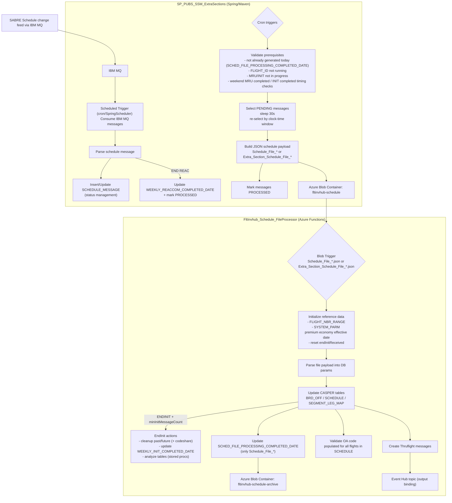

# SP_PUBS_SSM_ExtraSections
The Extra Section engine

```mermaid
flowchart TD
  %% Sources
  SABRE["SABRE Schedule change feed via IBM MQ"] --> MQ["IBM MQ"]

  %% Generator
  subgraph GEN["SP_PUBS_SSM_ExtraSections (Spring/Maven)"]
    MQ --> G1["Scheduled Trigger (cron/SpringScheduler) Consume IBM MQ messages"]
    G1 --> G2["Parse schedule message"]
    click G2 href "https://github.com/AAInternal/FltInvhub_Schedule_FileProcessor/wiki/File-Processor-Business-Rules"
    G2 --> G3["Insert/Update SCHEDULE_MESSAGE<br/>(status management)"]
    G2 -->|END REAC| G4["Update WEEKLY_REACCOM_COMPLETED_DATE<br/>+ mark PROCESSED"]

    G5{"Cron triggers"} --> G6["Validate prerequisites<br/>- not already generated today (SCHED_FILE_PROCESSING_COMPLETED_DATE)<br/>- FLIGHT_ID not running<br/>- MRU/INIT not in progress<br/>- weekend MRU completed / INIT completed timing checks"]
    G6 --> G7["Select PENDING messages<br/>sleep 30s<br/>re-select by clock-time window"]
    G7 --> G8["Build JSON schedule payload<br/>Schedule_File_* or Extra_Section_Schedule_File_*"]
    G8 --> G9["Mark messages PROCESSED"]
    G8 --> BLOB_IN["Azure Blob Container: fltinvhub-schedule"]
  end

  %% Processor
  subgraph PROC["FltInvhub_Schedule_FileProcessor (Azure Functions)"]
    BLOB_IN --> P1{"Blob Trigger<br/>Schedule_File_*.json or Extra_Section_Schedule_File_*.json"}
    P1 --> P2["Initialize reference data<br/>- FLIGHT_NBR_RANGE<br/>- SYSTEM_PARM premium economy effective date<br/>- reset endInitReceived"]
    P2 --> P3["Parse file payload into DB params"]
    P3 --> P4["Update CASPER tables<br/>BRD_OFF / SCHEDULE / SEGMENT_LEG_MAP"]

    P4 -->|ENDINIT + minInitMessageCount| P5["EndInit actions<br/>- cleanup past/future (+ codeshare)<br/>- update WEEKLY_INIT_COMPLETED_DATE<br/>- analyze tables (stored procs)"]
    P4 --> P6["Update SCHED_FILE_PROCESSING_COMPLETED_DATE<br/>(only Schedule_File_*)"]
    P6 --> BLOB_ARC["Azure Blob Container: fltinvhub-schedule-archive"]
    P4 --> P7["Validate OA code populated for all flights in SCHEDULE"]
    P4 --> P8["Create Thruflight messages"]
    P8 --> EH["Event Hub topic (output binding)"]
  end

```
