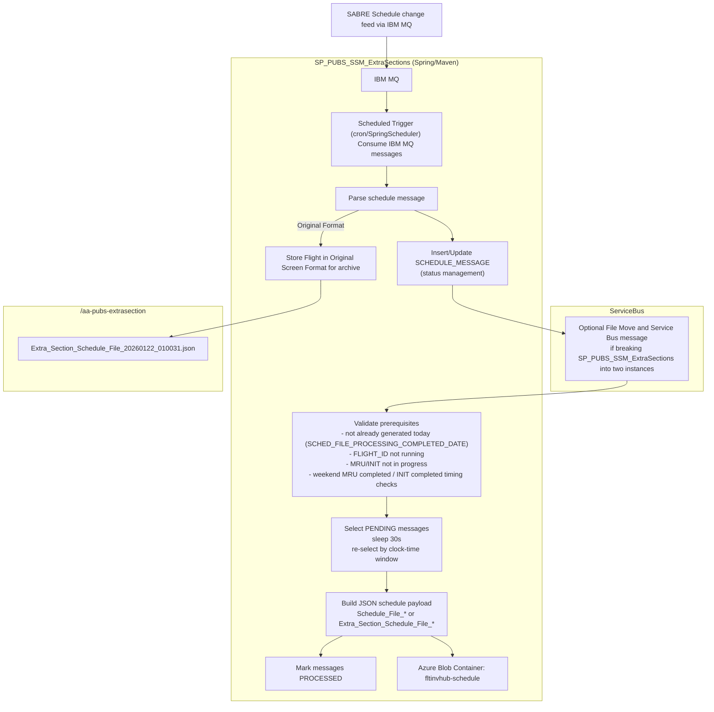

# SP_PUBS_SSM_ExtraSections

### The Extra Section Engine is a stand-alone SpringBoot/Kubernetes application running on a Production Publications Azure node. A SpringScheduler configuration prompts the Engine to regularly poll a SabreMQ via an IBM MQ schedule Upates. Extra sections are determined via flight range.  The Sabre green screen formatted data is effectively screen scraped and reformatted to an IATA standard SSM format in a file then transmitted to ITA via the existing NPPortal/EMFT file transfer system used for the Publications ITA SSIM transmits.

### Each extra session processed is archived to a dated file with the original green screen format and the resulting SSM format, a copy of this is included with a notification emailed to a configurable list of email recipients.

## Flowchart

